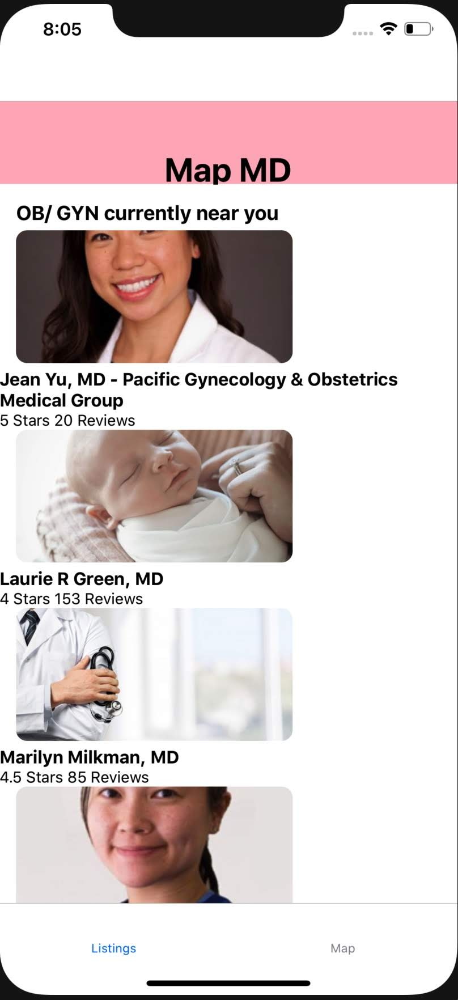

# Map MD

## Project Overview

Map MD is an app that finds a user's current location and pulls data to provide a listing of nearby gynecologists in the area. The inspiration behind this app was when I moved to New York and was looking for a physician nearby with information that was clear and easily accessible.

## Tech Stack

React and Firebase

